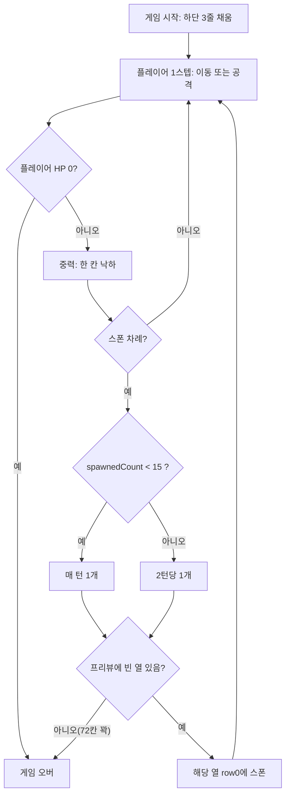

# 리사이클 라이프 — Week 1: 노드 이동 & 쓰레기 낙하

> 이번 주 목표: **플레이어가 그리드 노드를 이동하고, 움직일 때마다 쓰레기(낙하 블록)가 떨어지는** 코어 루프의 뼈대.
> 전투·연쇄는 이번 주 범위 아님 (→ `CORE_COMBAT.md`, 다음 단계). 여기선 쓰레기 = **부딪히면 막히는 낙하 블록**으로만 취급.
> 엔진: Unity 6 / C# · 타깃: Android · 입력: **버튼 방식**(스와이프 아님).
>
> ⚠️ 이 문서는 기획(강인표) 피드백 반영으로 **보드/스폰/게임오버 규칙이 갱신됨**. 이전 8×12안 폐기.

---

## 0. 이번 주 완료 기준 (Definition of Done)

- [ ] 8×8 플레이 영역 + 상단 프리뷰 1줄 그리드가 있고, 플레이어가 4방향 버튼으로 한 칸씩 이동한다.
- [ ] 게임은 **하단 3줄이 채워진 상태로 시작**한다.
- [ ] 플레이어가 **한 번 움직일 때마다** 쓰레기가 낙하 정착하고, **스폰 규칙(1턴당 1개 → 15개 이후 2턴당 1개)**대로 새 쓰레기가 프리뷰 줄로 투입된다.
- [ ] 플레이어가 낙하를 틀어막아 위로 꽉 차면 **플레이어가 강제로 한 칸 아래로 밀린다**.
- [ ] **72칸이 모두 차고 다음 스폰이 발생하는 턴**에 게임오버.
- [ ] 위 로직이 **EditMode 테스트로 검증**된다 (연출·아트 없이 순수 로직 먼저).

> 이번 주는 "재미"가 아니라 "루프가 결정론적으로 도는가"를 본다. 밸런스·이펙트는 나중.

---

## 1. 보드 규격 & 데이터 모델

**보드 = 8열 × 9행 (좌상단 원점, row 증가 = 아래, 중력 방향 = 아래).**

```
row 0        = 프리뷰(스폰 버퍼) 줄. 플레이어 상호작용 X. 화면엔 약 1/6만 노출(다음 블록 힌트). ← View 처리
row 1 .. 8   = 플레이 영역 (8줄)
합계         = 프리뷰 8칸 + 플레이 64칸 = 72칸
col 0 .. 7   = 8열
```

```
GridConfig(SO) : { int columns=8, int playableRows=8, int previewRows=1 }
                 // totalRows = playableRows + previewRows = 9. 코드에 리터럴 금지.

Grid   : Cell[columns, totalRows]
Cell   : Entity? occupant, bool IsPreviewRow   // row 0 이면 true
Entity : abstract { EntityKind Kind }
  ├ Player : { Vector2Int pos }
  └ Trash  : { TrashType type }   // 이번 주엔 type = 색/모양 구분용. hp/전투 없음(→ 나중에 Enemy로 확장)

enum EntityKind { Player, Trash }
enum TrashType  { A, B, C, D }    // PCG 전까지 임시. 스폰 시 랜덤
enum Direction  { Up, Down, Left, Right }
```

---

## 2. 한 스텝의 순서 (핵심)

플레이어 버튼 입력 1회 = 아래 페이즈를 **이 순서대로**:

```
Step(Direction dir):
  1. ResolveMove(dir)       // 이동 또는 공격. 경계 밖/프리뷰 줄은 §3
  2. ApplyGravity()         // 쓰레기가 한 칸 내려온다. 플레이어 = 바닥 역할
  3. TrySpawn()             // 스폰 카운터/캐이던스에 따라 프리뷰 줄(row 0)에 투입 (§5)
  4. CheckGameOver()        // HP 0 / 72칸 꽉 + 스폰 차례에 놓을 칸 없음 (§7)
```

> **확정**: 4페이즈. 강제 밀어내기는 폐기됐다(§6) — 공격이 생기면서 필요 없어졌다.
> 중력이 스폰보다 먼저인 이유: 프리뷰 칸을 비워야 이번 턴 블록이 들어갈 자리가 생긴다.
> 반격으로 플레이어가 죽으면 페이즈 2~3은 건너뛰고 즉시 종료된다.

---

## 3. 이동 규칙 (TryMovePlayer)

```
target = player.pos + dir
if !InBounds(target):           return NoMove   // 경계 밖 → 무시
if target.IsPreviewRow:         return NoMove   // 프리뷰 줄로는 못 올라감
if cellAt(target) is empty:     MovePlayer(target)
else (Trash 있음):              Attack(target)   // 제자리 공격 → CORE_COMBAT.md §3·§5
```

- **무효 입력(경계 밖 / 프리뷰 줄)이면 보드는 진행하지 않는다.**
- ~~막힘 시 진행 여부 = `advanceOnBlocked`~~ → **구현 완료 후 런타임에서는 무의미해졌다.**
  전투가 붙으면서 쓰레기는 막는 대상이 아니라 때리는 대상이 됐고, `CombatMoveResolver`는
  `BlockedByEntity`를 내지 않는다. 설정값과 `BlockingMoveResolver`는 남아 있다 —
  막는 지형(Terrain)이 생기면 그때 다시 쓴다.
- **공격도 이동과 똑같이 한 턴을 쓴다.** 플레이어는 제자리에 있지만 보드는 진행한다.

---

## 4. 중력 / 낙하 (ApplyGravity)

**컬럼 정착 방식**: 각 열에서 쓰레기가 아래 빈 칸으로 떨어져 바닥/다른 블록/**플레이어 위**에 쌓인다.

```
ApplyGravity():
  for each column c:
    아래(Rows-2)에서 위로 스캔, 바로 밑이 비어 있는 Trash를 한 칸만 내린다
    단, 플레이어가 있는 칸은 통과 못 함 → 플레이어 위에 쌓임(막힘)
  (한 스텝 = 한 칸. 완전 정착이 아니다)
```

- **확정: 낙하는 턴당 한 칸이다.** 공중에 뜬 블록이 존재하고, 그 밑을 지나갈 수 있다.
  블록이 바닥까지 순간이동하지 않고 한 칸씩 내려오는 것이 "압박이 다가오는" 감각을 만든다.
- 한 번에 끝까지 떨어뜨려야 하는 경우(시작 연출을 건너뛸 때)는 `Settle()`을 따로 쓴다.
- 로직/뷰 분리: 로직은 칸 단위로만 움직이고, 그 사이를 부드럽게 잇는 건 렌더 계층 담당.

---

## 5. 스폰 (TrySpawn)

**시작 상태**: `playableRows`의 **하단 3줄(row 6·7·8)을 랜덤 Trash로 채운 상태로 시작**. 플레이어는 그 위 빈 칸에 배치(정확한 시작 좌표 §9).

**스폰 캐이던스** (스폰된 블록 수 `spawnedCount` 기준):
```
spawnedCount < 15  → 매 턴 1개
spawnedCount >= 15 → 2턴당 1개  (turnsSinceSpawn 카운트)
```
> `15`, `1`, `2`는 모두 `SpawnConfig`(SO) 값. 리터럴 금지.

**스폰 위치 규칙**:
```
TrySpawn():
  이번 턴 스폰 차례가 아니면 return
  후보 = 프리뷰 줄(row 0)에서 빈 칸이 있는 열들
  단, 플레이 8칸이 이미 꽉 찬 열은 기본적으로 스폰 제외
       (예외: 아래 '오버플로 조건'에서 프리뷰로 밀어붙임)
  후보 중 랜덤 열 골라 row 0 에 랜덤 Trash 배치
  배치 즉시 다음 ApplyGravity에서 플레이 영역으로 낙하

  오버플로 조건(둘 중 하나면 프리뷰 줄까지 강제 채움 → 게임오버 경로):
    (a) 플레이 64칸이 모두 참
    (b) 플레이어가 낙하를 막아 더 내려갈 수 없음
```

---

## 6. ~~강제 밀어내기 (ResolveForcePush)~~ — **폐기**

**기획 결정: 구현하지 않는다.** 공격이 생기면 플레이어가 스스로 막힌 열을 뚫을 수 있어
밀어내기가 필요 없어진다. 페이즈 목록(§2)과 플로우차트(§8)에서도 빠졌다.

---

## 7. 게임오버 (CheckGameOver)

판정 순서대로:

1. **`PlayerDead`** — 반격 누적으로 플레이어 HP가 0. (CORE_COMBAT.md §5)
2. **`BoardFull`** — 72칸(프리뷰 포함 전체)이 모두 찬 상태에서 **스폰 차례가 왔는데 놓을 칸이 없을 때**.
   꽉 찬 것만으로는 지지 않는다. 스폰 차례가 아닌 턴에 빠져나가면 계속 플레이한다.
3. **`PlayerTrapped`** — 4방향 어디로도 행동할 수 없을 때.
   **전투가 붙은 뒤로는 사실상 발생하지 않는다** — 사방이 쓰레기여도 때릴 수 있기 때문이다.
   "무엇이 행동인가"는 이동 규칙(`IMoveResolver.CanAct`)이 정하므로, 규칙이 두 군데로 갈라지지 않는다.

~~강제 밀어내기조차 불가하면 패배~~ → §6 폐기와 함께 삭제.

---

## 8. 스폰/게임오버 로직 흐름 (기획 플로우차트를 코드용으로 옮김)



---

## 9. ✅ 확정 완료 (기획 확인 끝)

1. ~~`spawnedCount = 15` 기준~~ → **확정: 진행 중 스폰만 센다.** 시작 3줄은 포함하지 않는다.
2. ~~페이즈 순서(밀어내기 ↔ 스폰)~~ → **밀어내기 폐기(§6).** 순서는 이동/공격 → 중력 → 스폰 → 판정.
3. ~~오버플로 '다시 생성' 2조건~~ → **확정: 한 열의 플레이 8칸이 차면 그 열은 스폰 제외.
   단 플레이 64칸이 전부 차면 잠금을 풀고 프리뷰 줄에 쌓는다.** 프리뷰까지 찬 뒤 스폰 차례가 오면 패배.
4. ~~플레이어 시작 좌표~~ → **확정: 시작 3줄 바로 위(`GridConfig.playerStart`, 기본 (4,5)).**
   막혀 있으면 같은 열에서 위로 첫 빈 칸을 찾는다.
5. ~~밀어내기 시 아래가 막힌 경우~~ → §6 폐기로 소멸.

**남은 낙하 관련 확정 사항**: 낙하는 **턴당 한 칸**(§4). 시작 3줄도 한 줄씩 떨어져 쌓인다.

---

## 10. 구현 순서 체크리스트

- [x] `GridConfig`(SO) + `BoardGrid` + `InBounds` — 프리뷰는 플래그가 아니라 `FirstPlayableRow` 경계로 처리
- [x] 시작 상태 빌더: 하단 3줄 채움 + 플레이어 배치 + **테스트**
- [x] `TryMovePlayer` (버튼 4방향, 프리뷰 진입 금지)
- [x] `ApplyGravity` 턴당 한 칸(플레이어=바닥) + **테스트**
- [x] `TrySpawn` 캐이던스(15 전/후) + 프리뷰 열 선택 + 컬럼 잠금 + **테스트**
- [x] ~~`ResolveForcePush`~~ — 폐기(§6)
- [x] `Step()` 4페이즈 결합 + `CheckGameOver` + **테스트**
- [x] MonoBehaviour View: 그리드 렌더 + 프리뷰 1/6 노출 + 버튼 UI 연결

---

## 부록: Claude Code에게 이 문서를 줄 때

- 이 파일 + 얇은 `CLAUDE.md`(스택/컨벤션/가드레일)만 컨텍스트로 준다.
- **로직 계층(테스트 가능)과 MonoBehaviour/View를 분리**해 달라고 명시.
- "§9 확인 필요 항목은 임의로 정하지 말고 물어봐라"라고 지시.

---

## 🚫 Claude Code — 하지 말아야 할 것 (Hard Rules)

> 이 규칙은 개별 요청보다 **우선**한다. 규칙을 어기게 되는 상황이면, 코드를 짜지 말고 **먼저 물어봐라.**

### 팀 지정 규칙
1. **하드코딩 금지.** 인스펙터에서 조절 가능한 값(이동 속도, 중력, 스폰 개수, 보드 크기 등)을 코드 리터럴로 박지 말 것.
   → `[SerializeField] private` 필드 또는 `ScriptableObject`로 노출.
   (나쁜 예: 코드에 `gravity = 0;`을 고정 — 인스펙터에서 못 바꿈)
2. **UI 강제 고정 금지.** 게임 시작 시 **코드로 UI 위치·앵커·해상도·레이아웃을 강제 세팅/잠그지 말 것.** 나중에 수정이 매우 어려워진다.
   → 배치는 씬/프리팹/앵커로, 코드는 상태 전환·데이터 바인딩만.
3. **확장 가능한 구조로 짤 것.** 나중에 추가/교체될 여지가 있는 부분(적 종류, 재질, 스폰 규칙, 아이템 등)은 `enum switch` 떡칠·`if` 분기 대신 **인터페이스 / 데이터(SO) / 전략 패턴**으로 갈아끼울 수 있게.
4. **God object 금지.** `GameManager` 하나에 전부 모으고 인스펙터에 다 꽂는 구조 거부. **책임별로 클래스를 나누고**, 참조는 이벤트/주입으로 연결. (찾기 어렵고 지저분함)

### 추가 규칙 (Unity·모바일 실무 — Claude가 제안, 팀 검토)
5. **로직 ↔ MonoBehaviour 분리.** 게임 규칙을 `Update()`나 MonoBehaviour 안에 섞지 말 것. **순수 C# 로직(테스트 가능) + 얇은 View 계층**으로 분리.
6. **취약한 참조 금지.** `GameObject.Find`, `FindObjectOfType`, `Resources.Load("문자열경로")` 남발 금지. → 직렬화 참조·이벤트·경량 DI로 연결.
7. **Singleton/static 남발 금지.** 전역 상태를 여기저기 만들지 말 것(4번의 변형). 꼭 필요한 경우만, 이유를 주석으로 남기고.
8. **핫패스 할당 금지(Android 타깃).** 매 프레임 `Update`·전투 루프에서 `new`, LINQ, 문자열 결합 등 GC 유발 코드 금지. 컬렉션은 재사용.
9. **요청 안 한 대규모 변경 금지.** 시키지 않은 전면 리팩터, 파일·씬 삭제, 폴더 구조 변경 금지. **하기 전에 반드시 확인.**
10. **임의 패키지/에셋 추가 금지.** 서드파티 패키지·에셋 설치는 먼저 물어볼 것.
11. **미확정(⚠️) 항목 임의 확정 금지.** 문서의 "미확정 / 기획 확인 필요" 항목을 스스로 정하지 말고 질문.
12. **검증 없이 "완료" 선언 금지.** 최소 EditMode 테스트 또는 재현 방법을 함께 제시.